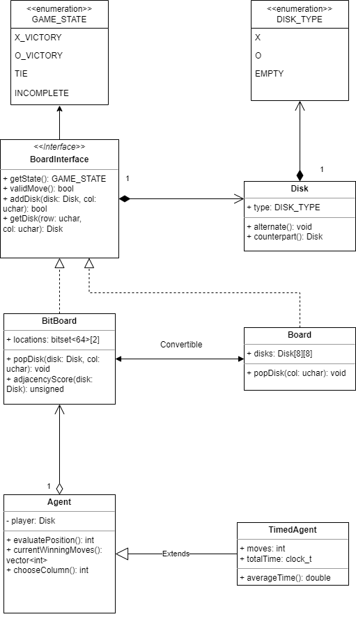
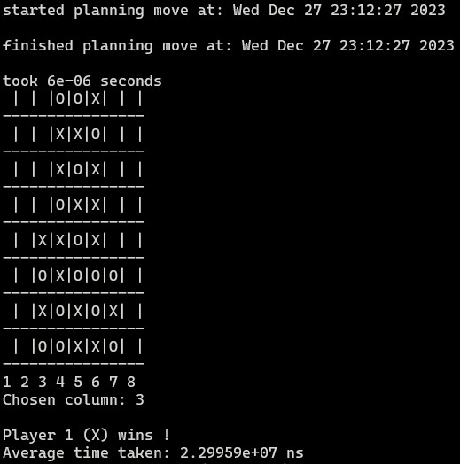

# Four-in-a-Row-Engine
Game-playing engine for Connect 4 variant with more rows and columns

By Xingzhe Li, Daniel Roche, Jianqi Shi, Ching-Heng Hsiao

## Architecture


The project initially only involved providing a user interface to play the Four-in-a-Row game and had the artificial constraint of having a Disk class.
This led to the development of a `Board` class that stored the positional information as a 2D-array of Disk objects.

However, in the next phase of the project, we were required to implement a game-playing algorithm to compete against other teams.
We chose the [negamax algorithm with alpha-beta pruning](https://en.wikipedia.org/wiki/Negamax#Negamax_with_alpha_beta_pruning).
This required evaluating the board to determine winning positions, but the `Board` class required many array accesses to determine
whether there was a four-in-a-row, and the program appeared to be impractically slow before recompiling with `-O3`, so the board
interface was rewritten as a [bitboard](https://en.wikipedia.org/wiki/Bitboard), which allowed checking the entire board at once
using bitwise operations and significantly improved the speed.

A heuristic was also added to the `BitBoard` class in its `adjacencyScore()` member function, which roughly computes a score based on
how many disks of a certain type are adjacent to each other. This appeared to improve the performance against a human player, as it
encouraged the AI to setup positions that can achieve a four-in-a-row from multiple places.

The computer-generated moves were accessed via the `Agent` class, which was extended to `TimedAgent` to compare the performance between
`Board` and `BitBoard`. The `BoardInterface` shown in the diagram is a mere conceptualization, and is not represented in the code as an abstract
class, so the performance differences were measured via different code versions rather than through dependency injection and dynamic dispatch
or template parameters.
This was justified because the original `Board` class was no longer necessary for any purpose, being superseded by `BitBoard`.


## Example run
When the first input to the program is not 'X' or 'O' and the standard input stream is still valid, the program plays against itself.
Here is the final board state of such a run.



## Running
On *nix-based systems:

Clone the repository, and from the project directory, execute:
```sh
c++ main.cpp -O3 && ./a.out
```

It does not appear to be feasible for a human to beat the program.
